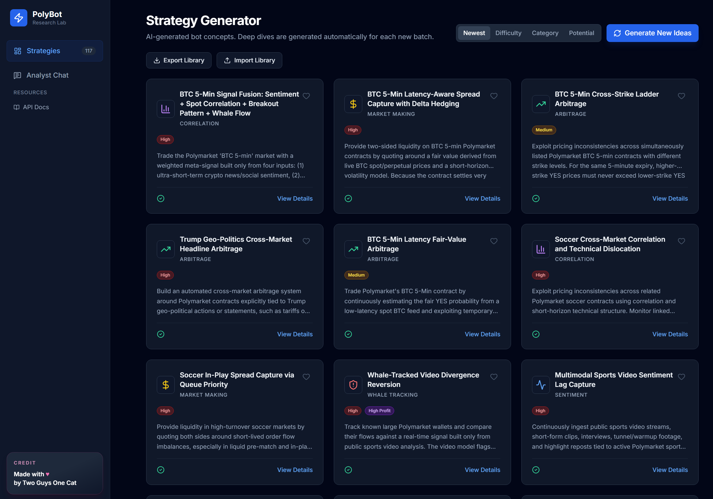

# PolyBot Research Lab

PolyBot Research Lab is an OpenAI-powered strategy workbench for Polymarket bot research. It generates structured strategy ideas, expands them into technical deep dives, keeps a persistent local strategy database, and gives you an analyst-style chat interface for iterating on edges before you build real automation.

Built for people who want to research prediction-market automation seriously before writing execution code.

[](https://pbresearch.twoguysonecat.com/)
[](LICENSE)
[](./package.json)

Explore the live demo: [pbresearch.twoguysonecat.com](https://pbresearch.twoguysonecat.com/)



## Features

- **20 Default Strategies**: A tighter default set seeded from GPT-5.4 when the database is empty, with local JSON fallback.
- **AI-Powered Deep Dives**: Generates technical analysis automatically for each newly created batch and stores it in SQLite.
- **Analyst Chat**: Interactive AI assistant to discuss and refine trading concepts.
- **SQLite Persistence**: All strategies and analyses are saved in a local database.
- **Export / Import**: Download a full JSON backup of the strategy library and restore it later.
- **Gated Strategy Generation**: Keep the generate flow visible while preventing new API spend until explicitly enabled.
- **Gated Analyst Chat**: Keep the chat UI visible without spending credits until you explicitly enable it.
- **Demo Mode**: Easily gate API usage for public deployments.

## How It Works

- On first boot, the app seeds the local SQLite database with 20 strategies.
- If `OPENAI_API_KEY` is available, the seed set is generated with GPT-5.4.
- Strategy generation uses `medium` reasoning for throughput.
- Deep-dive analysis uses `medium` reasoning for stronger technical output without runaway cost.
- Newly generated batches automatically queue deep dives and persist the results.
- If OpenAI is unavailable, the app falls back to a local JSON seed file instead of crashing.

## Getting Started

### Prerequisites

- Node.js 20+
- OpenAI API key

### Installation

1. Clone the repository:
   ```bash
   git clone <your-repo-url>
   cd polybot-research-lab
   ```

2. Install dependencies:
   ```bash
   npm install
   ```

3. Set up environment variables:
   Copy `.env.example` to `.env` and add your `OPENAI_API_KEY`.
   ```bash
   cp .env.example .env
   ```

   Recommended defaults:
   - `DB_PATH=./polybot.db`
   - `ENABLE_STRATEGY_IMPORT=true`
   - `ENABLE_STRATEGY_GENERATION=true`
   - `ENABLE_ANALYST_CHAT=false`
   - `OPENAI_MODEL=gpt-5.4`
   - `OPENAI_GENERATION_REASONING=medium`
   - `OPENAI_DEEP_DIVE_REASONING=medium`
   - `OPENAI_CHAT_REASONING=medium`
   - `DEFAULT_SEED_COUNT=20`

4. Run in development mode:
   ```bash
   npm run dev
   ```

5. Build for production:
   ```bash
   npm run build
   npm start
   ```

## Environment Reference

| Variable | Purpose | Recommended value |
| --- | --- | --- |
| `OPENAI_API_KEY` | Enables live strategy generation, deep dives, chat, and first-run AI seeding | Your OpenAI project key |
| `DB_PATH` | Filesystem path for the SQLite database | `./polybot.db` locally, `/captain/data/polybot.db` on CapRover |
| `ENABLE_STRATEGY_IMPORT` | Enables server-side restore/import endpoint | `true` by default |
| `ENABLE_STRATEGY_GENERATION` | Enables the server-side Generate New Ideas endpoint | `true` for full app, `false` for view-only deployments |
| `ENABLE_ANALYST_CHAT` | Enables the server-side Analyst Chat endpoint | `false` by default |
| `OPENAI_MODEL` | Global fallback model | `gpt-5.4` |
| `OPENAI_GENERATION_MODEL` | Model used for batch strategy generation | `gpt-5.4` |
| `OPENAI_DEEP_DIVE_MODEL` | Model used for long-form strategy analysis | `gpt-5.4` |
| `OPENAI_CHAT_MODEL` | Model used for analyst chat | `gpt-5.4` |
| `OPENAI_GENERATION_REASONING` | Reasoning effort for bulk idea generation | `medium` |
| `OPENAI_DEEP_DIVE_REASONING` | Reasoning effort for deep technical writeups | `medium` |
| `OPENAI_CHAT_REASONING` | Reasoning effort for analyst chat | `medium` |
| `DEFAULT_SEED_COUNT` | Number of strategies generated or loaded into a fresh database | `20` |
| `VITE_DEMO_MODE` | Disables live AI features for public/demo deployments | `false` |

## Model Defaults

- `OPENAI_MODEL=gpt-5.4`
- `OPENAI_GENERATION_REASONING=medium`
- `OPENAI_DEEP_DIVE_REASONING=medium`
- `OPENAI_CHAT_REASONING=medium`

This gives better default strategy quality than the previous `gpt-4o-mini` setup while keeping bulk generation costs and latency reasonable.

## Export and Import

The dashboard includes:

- `Export Library`: downloads the full strategy database as a JSON backup
- `Import Library`: restores a previous export

Import is enabled by default:

- `ENABLE_STRATEGY_IMPORT=true`

Import supports two restore modes:

- `Replace`: wipe the current library and restore the imported backup exactly
- `Merge`: keep the current library and add imported entries on top

The exported JSON includes strategy metadata, deep dives, favorite state, analysis status, and creation timestamps.

If Export downloads the app HTML instead of JSON, the server is almost always still running an older build. Redeploy or restart the app so the `/api/strategies/export` endpoint is live.

## Strategy Generation Gating

Generate New Ideas can stay visible in the UI without actually allowing new strategy generation.

To enable live generation, set:

- `ENABLE_STRATEGY_GENERATION=true`

To ship a browse-only deployment where users can view the library but not create new strategies:

- `ENABLE_STRATEGY_GENERATION=false`

## Analyst Chat Gating

The Analyst Chat tab remains visible even when chat is disabled.

By default:

- users can open the chat UI
- users can type into the input
- sending is blocked so no chat credits are spent

To enable live Analyst Chat, set:

- `ENABLE_ANALYST_CHAT=true`

This split keeps the frontend and backend aligned:

- the frontend fetches feature availability from the backend at runtime
- the backend still rejects requests unless the server env var is enabled

## Deployment

### CapRover

This repository now includes a production `Dockerfile` and `captain-definition`.

Before deploying, make sure the app has:

- `OPENAI_API_KEY` configured on the server
- `DB_PATH` configured to a persistent volume location
- `DEFAULT_SEED_COUNT=20` if you want the new tighter default seed size
- `VITE_DEMO_MODE=false` if you want live generation enabled
- persistent storage for the SQLite file if you want saved strategies to survive redeploys

Suggested CapRover app settings:

- App port: `3000`
- Persistent directory: create one, for example `/captain/data`
- Environment variables:
  - `OPENAI_API_KEY`
  - `DB_PATH=/captain/data/polybot.db`
  - `ENABLE_STRATEGY_IMPORT=true`
  - `ENABLE_STRATEGY_GENERATION=true`
  - `ENABLE_ANALYST_CHAT=false`
  - `OPENAI_MODEL=gpt-5.4`
  - `OPENAI_GENERATION_REASONING=medium`
  - `OPENAI_DEEP_DIVE_REASONING=medium`
  - `OPENAI_CHAT_REASONING=medium`
  - `DEFAULT_SEED_COUNT=20`
  - `VITE_DEMO_MODE=false`

Deployment flow:

1. Create a new CapRover app.
2. Connect the repo or deploy from this directory.
3. In CapRover, add a persistent directory for the app, for example mapping the app path `/captain/data`.
4. Set the environment variables above, especially `DB_PATH=/captain/data/polybot.db`.
5. Deploy or redeploy the app.
6. Visit `/api/strategies` once after first boot to confirm the initial seed completed.

Why this matters:

- Redeploying the code should not wipe the database if `DB_PATH` points to a persistent directory.
- The app code can be replaced safely while the SQLite file remains in the mounted volume.
- You should keep the app at a single replica when using SQLite.
- Import, strategy generation, and Analyst Chat are now controlled by runtime server env vars, so a restart is enough after changing those flags.

Backup recommendation:

- Use the built-in `Export Library` button before major upgrades or prompt experiments.
- Keep the CapRover persistent volume as the primary storage.
- Treat JSON export/import as a portable backup and recovery layer.

### Docker

Build locally:

```bash
docker build -t polybot-research-lab .
docker run --rm -p 3000:3000 -e OPENAI_API_KEY=your_key_here polybot-research-lab
```

## Notes

- `polybot.db` is intentionally ignored and should not be committed.
- Use a persistent SQLite path via `DB_PATH` instead of baking a database into the repo or image.
- `.env.example` is the deployment template; `.env.local` is for machine-specific overrides.
- If OpenAI is unavailable during first boot, the app falls back to the local `strategies_seed.json` file.

### Demo Mode

To disable live AI generation and chat for public visitors, set:

- `VITE_DEMO_MODE=true`

## License

MIT
